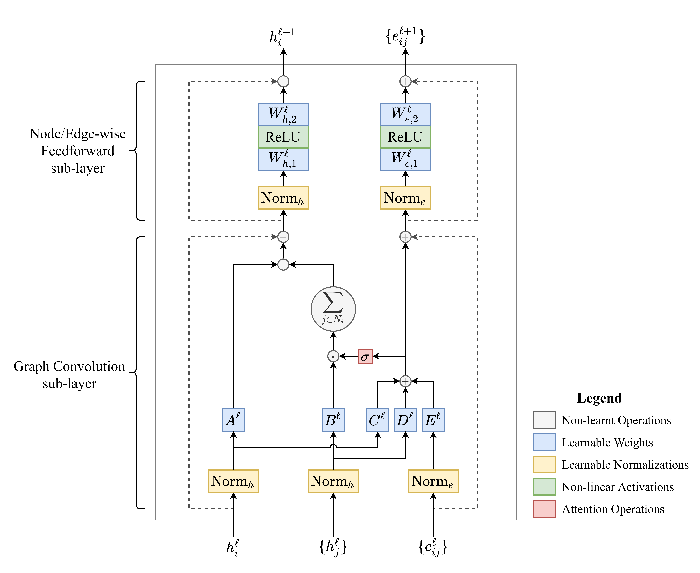

# :rocket: Gated Graph Transformers

>**Gated Graph Transformers** for graph-level property prediction, *i.e.* graph classification and regression.

This repository is my attempt to build intuitions about and track progress in **Graph Representation Learning** research. 
I aim to develop the most universal and powerful model which unifies state-of-the-art ideas and architectures from **Graph Neural Networks** and **Transformers**, without incorporating domain-specific tricks.



## Key Architectural Ideas

- **Deep, Residual Transformer Backbone** 
  - As the backbone architecture, I borrow the two-sub-layered, pre-normalization variant of Transformer encoders that has emerged as the standard in the NLP community, e.g. [GPT-3](https://arxiv.org/abs/2005.14165). Each Transformer block consists of a graph convolution sub-layer followed by a node-wise feedforward sub-layer. The graph convolution is described later. 
  - The feedforward sub-layer projects node embeddings to an *absurdly* large dimension, passes them through a non-linear activation function, does dropout, and reduces back to the original embedding dimension.
  - The Transformer backbone enables training very deep and extremely overparameterized models. Overparameterization is [important for performance in NLP](https://arxiv.org/abs/1910.10683) and other combinatorially large domains, but was previously not possible for GNNs trained on small graph classifcation datasets. Coupled with unique node positional encodings (described later) and the feedforward sub-layer, overparameterization ensures that our GNN is Turing Universal (based on A. Loukas's recent insightful work, including [this paper](https://arxiv.org/abs/1907.03199)).

- **Anisotropic Graph Convolutions** 
  - As the graph convolution layer, I use the [Gated Graph Convolution](https://arxiv.org/abs/1711.07553) with dense attention mechanism, which we found to be the best performing graph convolution in [Benchmarking GNNs](https://arxiv.org/abs/2003.00982).
  - Intuitively, Gated GraphConv [generalizes directional CNN filters](https://arxiv.org/abs/1905.01289) for 2D images to arbitrary graphs by learning a weighted aggregations over the local neighbors of each node. It upgrades the node-to-node attention mechanism from [GATs](https://arxiv.org/abs/1710.10903) and [MoNet](https://arxiv.org/abs/1611.08402) (i.e. one attention weight per node pair) to consider dense feature-to-feature attention (i.e. *d* attention weights for pairs of *d*-dimensional node embeddings). This graph convolution was originally proposed as [a sentence encoder for NLP](https://arxiv.org/abs/1703.04826) and further developed at NTU for [molecule generation](https://arxiv.org/abs/1906.03412) and [combinatorial optimization](https://arxiv.org/abs/1906.01227).
  - Another intuitive motivation for the Gated GraphConv is as a learnable directional diffusion process over the graph, or as a coupled PDE over node and edge features in the graph. Gated GraphConv makes the diffusion process/neighborhood aggregation anisotropic or directional, countering oversmoothing/oversquashing of features and enabling deeper models.
  - I am evidently partial to this graph convlution layer. At the same time, it is worth noting that anisotropic local aggregations and generalizations of directed CNN filters have demonstrated strong performance across a myriad of applications, including [3D point clouds](https://arxiv.org/abs/1904.07601), [drug discovery](https://pubs.acs.org/doi/abs/10.1021/acs.jcim.9b00237), [material science](https://openreview.net/forum?id=K3qa-sMHpQX), and [programming languages](https://arxiv.org/abs/1906.12192).

- **Graph Positional Encodings** 
  - I use the top-*k* non-trivial Laplacian Eigenvectors as unique node identifiers to inject structural/positional priors into the Transformer backbone. This generalization of positional encodings from the original Transformers, and was concurrently proposed in the Benchmarking GNNs, [EigenGNNs](https://arxiv.org/abs/2006.04330), and [GCC](https://arxiv.org/abs/2006.09963) papers.
  - Randomly flipping the sign of Laplacian Eigenvectors during training (due to symmetry) can be seen as an additional data augmentation or regularization technique, helping delay overfitting to training patterns. Going further, the [Directional Graph Networks](https://arxiv.org/abs/2010.02863) paper presents a more principled approach for using Laplacian Eigenvectors.

---

Some ideas still in the pipeline include:

- **Graph-specific Normalization** - Originally motivated in Benchmarking GNNs as 'graph size normalization', there have been several subsequent graph-specific normalization techniques such as [GraphNorm](https://arxiv.org/abs/2009.03294) and [MessageNorm](https://arxiv.org/abs/2006.07739), aiming to replace or augment standard Batch Normalization. Intuitively, there is room for improvement as BatchNorm flattens mini-batches of graphs instead of accounting for the underlying graph structure.

- **Theoretically Expressive Aggregation** - There are several exciting ideas aiming to bridge the gap between theoretical expressive power, computational feasability, and generalization capacity for GNNs: [PNA-style](https://arxiv.org/abs/2004.05718) multi-head aggregation and scaling, generalized aggreagators from [DeeperGCNs](https://arxiv.org/abs/2006.07739), pre-computing structural motifs as in [GSN](https://arxiv.org/abs/2006.09252), etc.

- **Virtual Node and Low Rank Global Attention** - After the message-passing step, the [virtual node trick](https://arxiv.org/abs/1905.12265) adds messages to-and-fro a virtual/super node connected to all graph nodes. [LRGA](https://arxiv.org/abs/2006.07846) comes with additional theretical motivations but does something similar. Intuitively, these techniques enable modelling long range or latent interactions in graphs and counter the oversquashing problem with deeper networks.

- **General Purpose Pre-training** - It isn't truly a Transformer unless its pre-trained on hundreds of GPUs for thousands of hours...but general purpose pre-training for graph representation learning remains an open question!

## Installation and Usage
```bash
# Create new Anaconda environment
conda create -n new-env python=3.7
conda activate new-env
# Install PyTorch 1.6 for CUDA 10.x
conda install pytorch=1.6 cudatoolkit=10.x -c pytorch
# Install DGL for CUDA 10.x
conda install -c dglteam dgl-cuda10.x
# Install other dependencies
conda install tqdm scikit-learn pandas urllib3 tensorboard
pip install -U ogb

# Train GNNs on ogbg-mol* datasets
python main_mol.py --dataset [ogbg-molhiv/ogbg-molpcba] --gnn [gated-gcn/gcn/mlp]

# Prepare submission for OGB leaderboards
bash scripts/ogbg-mol*.sh

# Collate results for submission
python submit.py --dataset [ogbg-molhiv/ogbg-molpcba] --expt [path-to-logs]
```

Note: The code was tested on Ubuntu 16.04, using Python 3.6, PyTorch 1.6 and CUDA 10.1.
